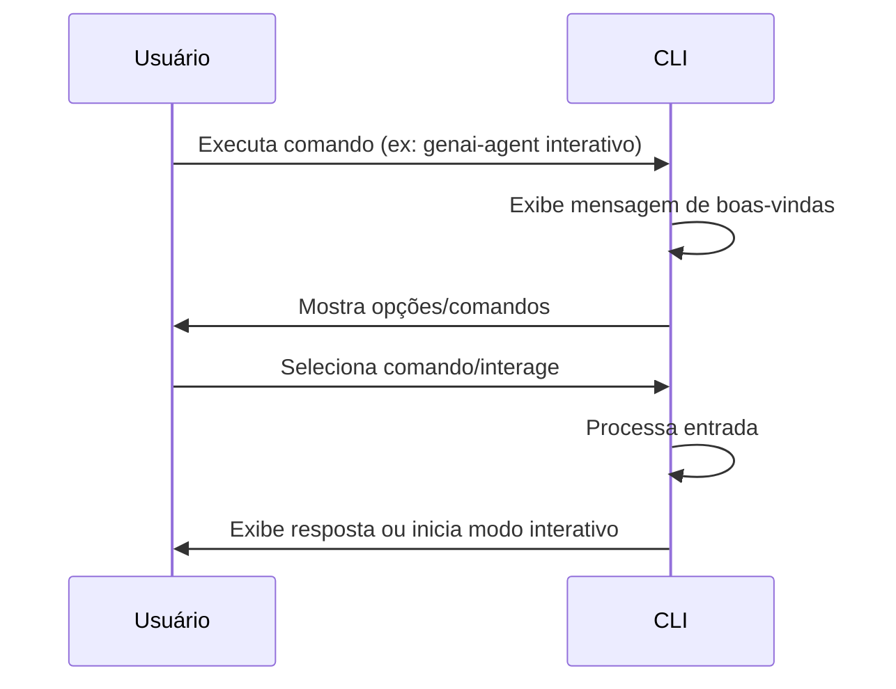

# CLI Básico

## Objetivo
Implementar a estrutura inicial do CLI, com comando principal, mensagem de boas-vindas e modo interativo (esqueleto).

## 🗂️ Diagrama de Sequência — Fluxo Básico

## Tarefas (To-Do)
- [x] Estrutura de pacote Python recomendada
- [x] Comando principal `genai-agent` com mensagem amigável
- [x] Comando `interativo` (esqueleto)
- [x] Mensagem de boas-vindas e help automático
- [x] README com instruções e badges

## Observações
- O CLI deve ser fácil de instalar e executar.
- O modo interativo será expandido nas próximas etapas. 