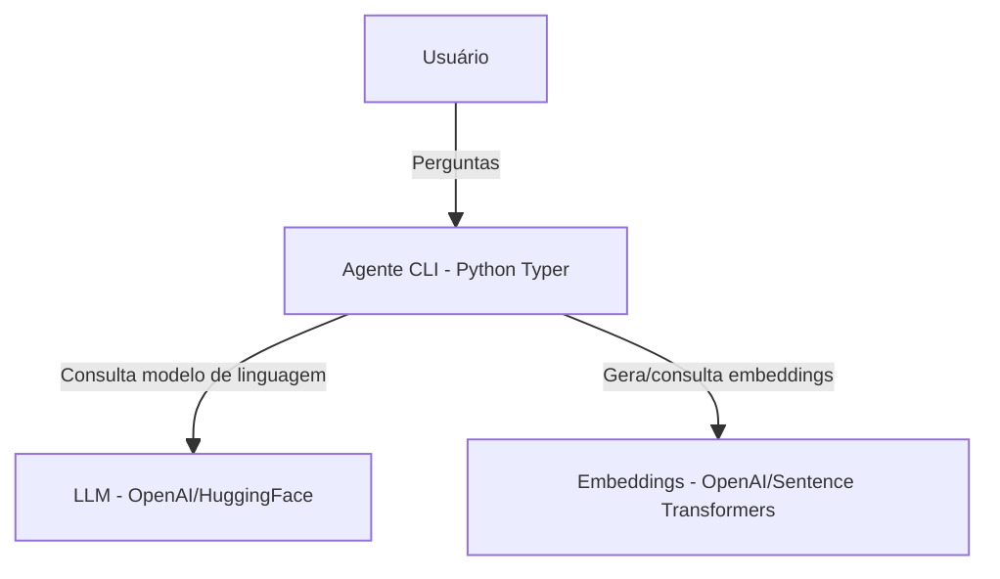

# Configuração da LLM e Embeddings

## 🗺️ Diagrama de Containers — LLM e Embeddings

## Objetivo
Configurar o modelo de linguagem (LLM) a ser utilizado pelo agente, bem como a estrutura de embeddings para análise semântica dos repositórios.

## Tarefas (To-Do)
- [x] Definir e integrar a LLM (ex: OpenAI, HuggingFace, etc)
- [x] Configurar provedores e parâmetros da LLM via arquivo de configuração
- [x] Implementar estrutura de embeddings para análise semântica
- [x] Permitir troca fácil de modelo/embeddings via configuração
- [x] Documentar opções e exemplos de configuração

## Observações
- A escolha da LLM e embeddings deve ser flexível e segura.
- O agente deve ser capaz de operar com diferentes provedores/modelos. 