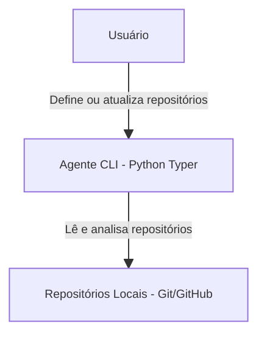

# Configuração dos Repositórios do Github

## Objetivo
Definir e configurar os repositórios do Github que o agente irá analisar, permitindo fácil apontamento e atualização.

## 🗺️ Diagrama de Containers — Repositórios

## Tarefas (To-Do)
- [ ] Estruturar arquivo de configuração para apontar múltiplos repositórios
- [ ] Permitir inclusão/remoção dinâmica de repositórios
- [ ] Validar existência e acesso aos repositórios definidos
- [ ] Documentar formato e exemplos de configuração

## Observações
- O agente deve ser flexível para trabalhar com diferentes conjuntos de repositórios.
- A configuração deve ser simples e segura para o usuário. 