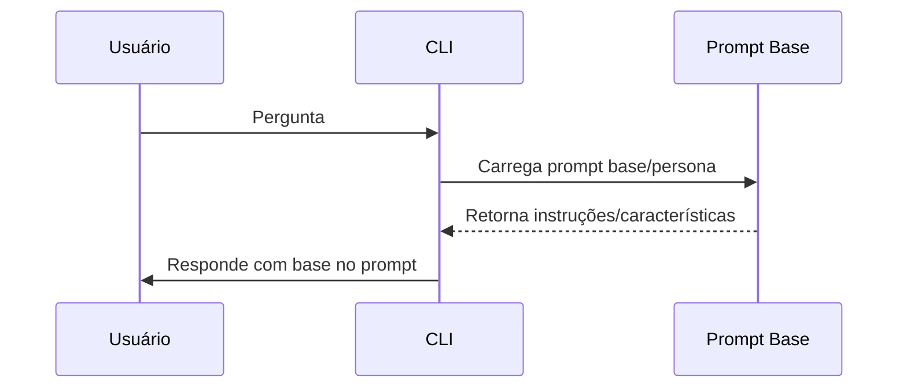

# Prompt Base e Características do Agente

## Objetivo
Criar uma estrutura para armazenar e versionar o prompt base do agente, incluindo suas características, persona e instruções de comportamento.

## 🔄 Diagrama de Sequência — Uso do Prompt Base

## Tarefas (To-Do)
- [ ] Definir formato e local do prompt base (ex: prompt.md, prompt.yaml)
- [ ] Permitir fácil edição e atualização do prompt
- [ ] Documentar as características e persona do agente
- [ ] Integrar o prompt base ao fluxo de geração de respostas

## Observações
- O prompt base é essencial para garantir consistência e especialização nas respostas.
- Mudanças no prompt devem ser versionadas e documentadas. 