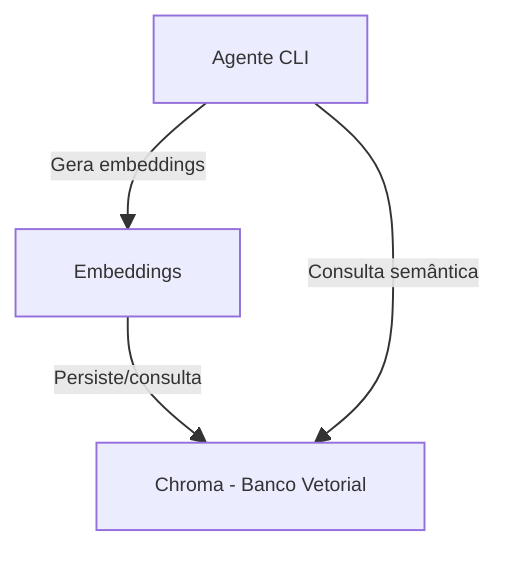

# Integração do Banco Vetorial (Chroma)

## Objetivo
Integrar o banco de dados vetorial Chroma para persistência e busca eficiente de embeddings, permitindo consultas semânticas rápidas sobre os repositórios analisados.

## 🗺️ Diagrama de Containers — Chroma

## Tarefas (To-Do)
- [ ] Adicionar dependência do Chroma ao projeto (via Poetry)
- [ ] Implementar integração com Chroma para persistência dos embeddings
- [ ] Configurar armazenamento local e parâmetros do Chroma
- [ ] Adaptar fluxo de consulta para usar busca vetorial
- [ ] Documentar exemplos de uso e configuração

## Observações
- O uso do Chroma permite escalabilidade e performance na busca semântica.
- A integração deve ser opcional/configurável para facilitar testes e evolução futura. 