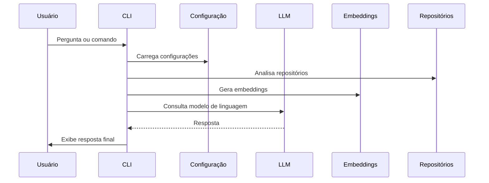

# Integração e Orquestração Final

## 🔄 Diagrama de Sequência — Fluxo Ponta a Ponta

## Objetivo
Unir todas as configurações, módulos e fluxos do agente para garantir o funcionamento ponta a ponta, com testes de usabilidade e ajustes finais.

## Tarefas (To-Do)
- [ ] Integrar módulos de configuração, análise, LLM, embeddings e prompt base
- [ ] Garantir fluxo de perguntas e respostas ponta a ponta
- [ ] Realizar testes de usabilidade
- [ ] Ajustar UX e mensagens do CLI
- [ ] Documentar exemplos de uso e casos de teste

## Observações
- Esta etapa garante que o agente funcione de forma coesa e pronta para uso real.
- Feedbacks de usuários e testes são fundamentais para ajustes finais. 